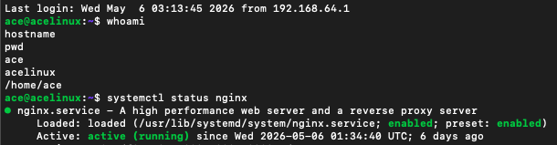
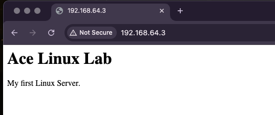
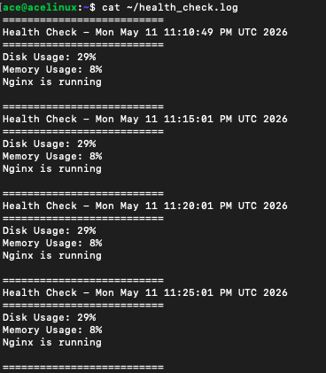
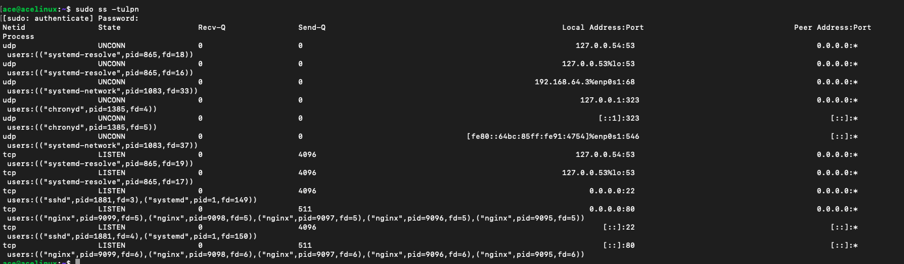
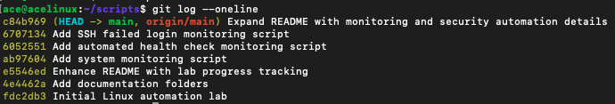
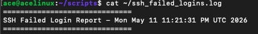
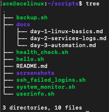

# Linux Automation Lab

## Project Goal

The goal of this lab is to develop practical Linux administration, automation, networking, monitoring, and troubleshooting skills through hands-on projects using Ubuntu Server and Bash scripting.

This project demonstrates foundational Linux administration and automation skills using Ubuntu Server, SSH, Bash scripting, cron jobs, nginx, Git/GitHub, and system monitoring tools.

---

## Skills Demonstrated

- Bash scripting
- Cron job scheduling
- Linux permissions and ownership
- SSH remote administration
- Nginx web server management
- Linux log analysis
- Service management with systemctl
- Backup automation
- System health monitoring
- Security log monitoring
- Network socket inspection
- Git and GitHub workflow

---

## Scripts

### system_monitor.sh

Performs automated Linux system health checks and logs the results for troubleshooting and monitoring purposes.

#### Checks Included
- Hostname verification
- System uptime
- Disk usage
- Memory usage
- Top memory-consuming processes
- Listening network ports
- Nginx service status

#### Why It Matters
System monitoring is critical for Linux administration, cloud operations, and cybersecurity. Monitoring scripts help administrators identify resource issues, detect service failures, analyze running processes, and troubleshoot systems proactively.

#### Technologies Used
- Bash scripting
- Linux process management
- Network socket inspection
- Log generation
- Service validation with systemctl

---

### health_check.sh

Performs automated Linux health checks and generates alerts for resource usage and service availability.

#### Features
- Disk usage monitoring
- Memory usage monitoring
- Nginx service validation
- Health check logging
- Automated cron execution

#### Why It Matters
Health monitoring allows administrators to proactively identify system issues before they become outages or service failures.

---

### ssh_failed_logins.sh

Analyzes Linux authentication logs to identify failed SSH login attempts.

#### Features
- SSH failed login detection
- Authentication log analysis
- Security monitoring automation
- Bash-based reporting

#### Why It Matters
Monitoring failed SSH logins is important for detecting brute-force attacks, unauthorized access attempts, and suspicious authentication activity.

---

### backup.sh

Creates timestamped backups of the scripts directory and logs backup activity.

#### Features
- Timestamped backups
- Automated directory creation
- Backup logging
- Cron job compatibility

---

### hello.sh

Basic Bash script demonstrating execution permissions and shell scripting fundamentals.

---

### userinfo.sh

Displays current user and system date information using Bash variables and command substitution.

---

## Core Technologies

- Ubuntu Server
- Bash
- Cron
- Nginx
- SSH
- Git/GitHub
- systemctl
- Linux networking tools
- Linux log management

---
## Screenshots

### SSH Remote Administration
Demonstrates remote Linux administration over SSH from the host machine.

---

### Nginx Custom Web Page
Custom nginx web server page hosted from the Ubuntu Linux server.

---

### System Health Monitoring
Automated Linux health monitoring showing disk usage, memory usage, and nginx service validation.

---

### Network Services and Open Ports
Inspection of active listening services and open ports using Linux networking tools.

---

### Git Commit History
Git version control workflow demonstrating iterative Linux lab development.

---

### SSH Security Monitoring
Automated monitoring of failed SSH login attempts through Linux authentication logs.

---

### Project Structure
Organized Linux automation lab structure including scripts, documentation, and screenshots.

---

## Lab Progress

### Completed
- Installed Ubuntu Server in UTM virtual environment
- Configured SSH remote administration
- Installed and managed Nginx web server
- Analyzed system and application logs
- Inspected listening ports and network services
- Created Bash automation scripts
- Automated backups using cron jobs
- Implemented timestamped backup logging
- Managed Linux users, groups, and permissions
- Built Linux system monitoring scripts
- Built SSH failed login monitoring automation
- Used Git and GitHub for version control

---

### Upcoming Goals
- Docker containerization
- AWS EC2 deployment
- Security hardening
- Log rotation
- Infrastructure automation
- Centralized monitoring
- Reverse proxy configuration
- SIEM integration

---

## Portfolio Purpose

This repository serves as a hands-on Linux administration and automation portfolio demonstrating practical infrastructure, monitoring, scripting, troubleshooting, and security-focused operational skills.
